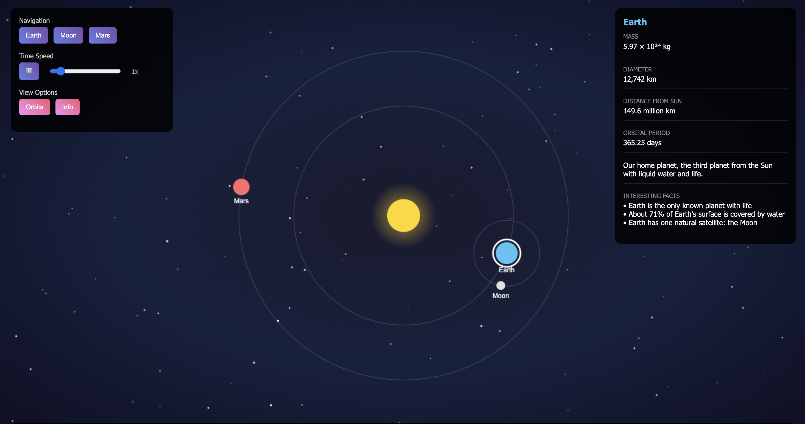

# 🌌 Solar System Explorer

**Solar System Explorer** is an interactive 2D simulation of the solar system built entirely with HTML5 Canvas and vanilla JavaScript — no external libraries required.  
It lets you explore celestial motion, zoom, pan, view information panels, and learn space science concepts like gravity, orbits, and distances.



---

## 🚀 Features

- 🌞 Real-time orbital simulation of the Earth, Moon, and Mars  
- 🎛️ Interactive controls: pan, zoom, pause, and adjust time speed  
- 🔭 Focus buttons for Earth, Moon, and Mars  
- 📚 Educational overlays explaining **orbital mechanics**, **gravity**, and **space distances**  
- 🌌 Dynamic starfield background  
- 🖱️ Mouse and keyboard interactions (drag, scroll, shortcuts)

---

## 🧭 Controls

| Action | Description |
|--------|--------------|
| Drag Mouse | Move camera |
| Scroll Wheel | Zoom in/out |
| Click Body | Select a planet or moon |
| Spacebar | Pause / Play simulation |
| Keys 1–3 | Focus Earth (1), Moon (2), Mars (3) |
| O / D / G | Show educational overlays (Orbital Mechanics / Distances / Gravity) |

---

## 🛠️ Installation & Usage

1. Clone this repository:
   ```bash
   git clone https://github.com/AndreyWinz/solar-system-explorer.git
   cd solar-system-explorer
2. Open the project:
   ```bash
   open solar_game.html
Or just drag the HTML file into your web browser.

That’s it! No server setup required.

## 📁 Project Structure
```graphql
solar-system-explorer/
├── solar_game.html   # Main HTML, CSS, and JS combined
├── preview.png       # (Optional) Screenshot for GitHub preview
├── .gitignore
└── LICENSE
```

## 🧩 Future Improvements

Add more planets and moons

Implement 3D perspective or depth scaling

Include sound or narration for educational content

Add touch controls for mobile devices

## 🪪 License

This project is licensed under the MIT License — see LICENSE
 for details.

## 👨‍🚀 Author

Developed by AndreyWinz

Feel free to contribute, fork, or suggest new features!

## P.S.
I do these projects purely for fun, and I decided to upload them to GitHub to share with others. I am not asking or begging for a donation, but if you want to appreciate my work, feel free to donate! You can also send your GitHub username in the "Note" section of the donation page, so I can give you a shout-out in the next repository. Stay tuned for more!

This is my Revolut Payment Link:
[Thank you so much!](https://revolut.me/andreygdl9)
